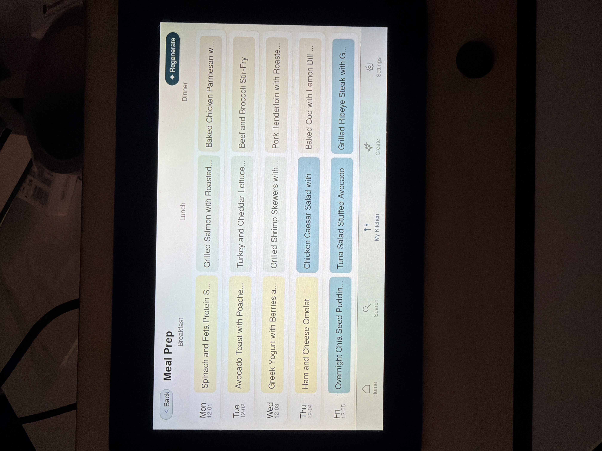
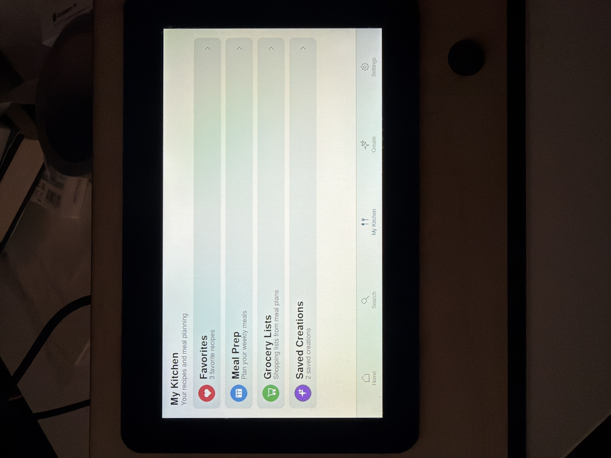
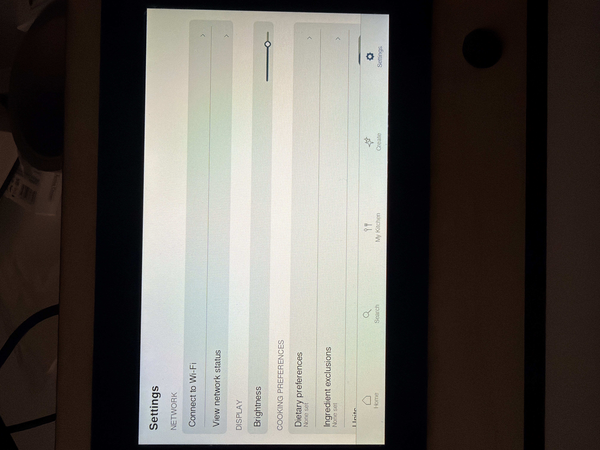

# AI Sous Chef

| Home View | Create View | Search Recipes View |
|:--:|:--:|:--:|
|  |  |  |

| Meal Prep View | My Kitchen View | Settings View |
|:--:|:--:|:--:|
|  |  |  |

[Watch Demo on YouTube](https://youtube.com/shorts/lS2LWb7GAdI?feature=share)

**A hands-free, low-cost kitchen assistant powered by AWS and on-device interaction.**

AI Sous Chef is a fully custom, AI-powered kitchen assistant built using AWS, Amazon Bedrock, and a Raspberry Pi.

It features a 7-inch touchscreen interface, a complete ETL pipeline for recipe ingestion, and integrated generative AI capable of creating, modifying, and organizing recipes in real time. The goal of the project is to provide a fast, intuitive, stand-alone cooking assistant that removes friction from meal planning and recipe discovery.

The motivation is simple:

Cooking shouldn’t require a phone, a search engine, or patience. Just ask, and cook.

## Overview

This project combines cloud infrastructure, embedded development, and generative AI into a single end-to-end product.

The system includes:

1. A full AWS ETL pipeline to clean and index thousands of recipes.
2. An AI layer that generates and modifies recipes using Amazon Bedrock.
3. A Raspberry Pi application built with Python/PyGame for the touchscreen interface.

All AWS resources are provisioned and torn down programmatically using boto3.

## Tech Stack
### ETL Pipeline
* EC2: Executes the ETL pipeline that processes the raw recipes dataset.
* S3: Stores the raw dataset, cleaned recipe JSON files, and metadata.
* DynamoDB: Holds recipe metadata for efficient, low-cost key-value lookups.
* VPC: Provides isolated networking for ETL execution.
* IAM: Manages fine-grained access control for EC2, S3, DynamoDB, and Bedrock.
* boto3 Automation: ETL scripts automatically provision and tear down all AWS resources; the AWS console is never used manually.

### AI
* Amazon Bedrock: Utilizes Claude 3 Haiku for recipe generation and modification (selected for low inference cost and fast response times).

### Device Software
* Python/PyGame: Renders the entire touchscreen UI, input handling, keyboard, and screen navigation.
* Raspberry Pi OS: Runs the application as a fullscreen system service.

## Functionalities

### Core Features
* Full on-screen touch keyboard
* Search the recipe database with keywords or structured filters
* Generate new recipes from scratch using natural language
* Modify existing recipes (examples: increase servings, remove ingredients, adjust macros)
* Generate weekly meal plans from text instructions
* Convert meal plans into grocery lists in one button press
* Save, favorite, and organize recipes
* Dietary and ingredient preference system (affects generation and search)
* Cooking skill level adjustment for recipe complexity
* Built-in kitchen timer

### System Features
* Connect to Wi-Fi networks through the UI
* Adjust display brightness
* Toggle units (US/metric)
* Software updates via a single button (pulls latest application build)
* Restart or shut down the device

## Future Work

**Planned enhancements include:**

* Voice-controlled recipe generation using Bedrock
* Vision system for cooking guidance (ingredient recognition, doneness checks, step verification)
* Nutrition-based meal planning with constraints
* User profiles with personalized models
* Companion mobile app for syncing grocery lists

## Dataset

* Uses the Kaggle dataset – Food.com - Recipes and Reviews – containing over 500,000 detailed recipes.

## AWS Disclaimer

Amazon Web Services is an integral component of this project, so I write Infrastructure as Code (IaC) to provision and tear down almost all AWS services and functionalities programatically. However, some actions (such as creating an access key) must be completed first in the console; re-creating this project requires a baseline understanding of AWS.
